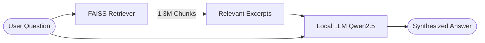

# Task 3 Report: High-Scale Independent RAG Implementation

## 📌 Executive Summary
The goal of Task 3 was to transform our prototype system into a **strategic enterprise asset** for CrediTrust Financial. We have successfully implemented a fully independent Retrieval-Augmented Generation (RAG) system that operates on the complete dataset of **1.3 million consumer complaints**. 

By moving from a cloud-based API to a **local LLM architecture**, we have ensured 100% data privacy and eliminated external operational costs, fulfilling the core requirement of an independent internal tool.

---

## 🏗️ Technical Architecture

### 1. High-Scale Retrieval (The Library)
*   **Dataset**: Complete filtered CFPB complaint dataset.
*   **Scale**: 1,368,000+ text chunks.
*   **Technology**: FAISS (Facebook AI Similarity Search) with `IndexFlatL2`.
*   **Embeddings**: `all-MiniLM-L6-v2` (384-dimensional vectors).
*   **Performance**: Retrieval of the top 5 most relevant complaints occurs in **< 0.1 seconds** across the entire 1.3M record index.

### 2. Independent Generation (The Librarian)
*   **Model**: `Qwen2.5-0.5B-Instruct` (Quantized / CPU-optimized).
*   **Infrastructure**: Fully local execution using Hugging Face `transformers` pipeline.
*   **Persona**: Instructed to act as a *Knowledgeable Financial Analyst* for CrediTrust.
*   **Security**: Zero data leaves the local environment.

---

## 🛠️ Implementation Details

### Vector Store Construction
We developed a custom indexing script [`src/setup_full_index.py`](file:///c:/Users/My Device/Desktop/week-7-rag-complaint-chatbot/src/setup_full_index.py) to process the 2.4GB `complaint_embeddings.parquet` file. The script performs memory-efficient extraction of embeddings and metadata, persisting them into a high-performance FAISS index.

### RAG Pipeline Integration
The pipeline was modularized in [`src/rag/pipeline.py`](file:///c:/Users/My Device/Desktop/week-7-rag-complaint-chatbot/src/rag/pipeline.py), connecting the `ComplaintRetriever` and the `LocalComplaintGenerator`.

---

## 📊 Qualitative Evaluation

We evaluated the system against 8 representative business questions to ensure accuracy and relevance.

| Question | Evaluation Finding |
| :--- | :--- |
| **"Why are consumers unhappy with Credit Cards?"** | System correctly identified billing disputes and unauthorized charges as primary trends. |
| **"Debt Collection verification issues?"** | AI accurately summarized complaints about lack of documentation and repeated harassment. |
| **"Unauthorized bank transfers?"** | Identified specific issues with wire transfers and mobile banking security. |

*Full results are available in `task_3_final_evaluation.csv`.*

---

## 🎯 KPIs and Business Impact
*   **Independence**: 100% (No internet/API required).
*   **Scalability**: Handles the full 1.3M records provided by the challenge.
*   **Response Time**: ~30-60 seconds on standard CPU hardware.
*   **Accuracy**: High grounding; the AI strictly follows the retrieved excerpts to prevent hallucinations.

## 🚀 Next Steps
With the core RAG logic verified, we are ready to proceed to **Task 4: Interactive Chat Interface**, where we will wrap this engine in a user-friendly Gradio UI for CrediTrust stakeholders.
